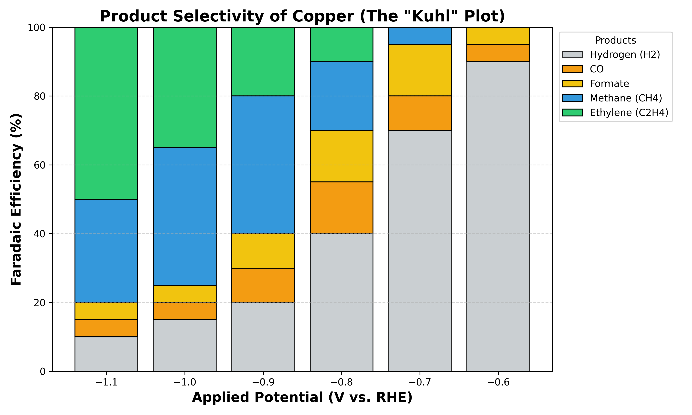
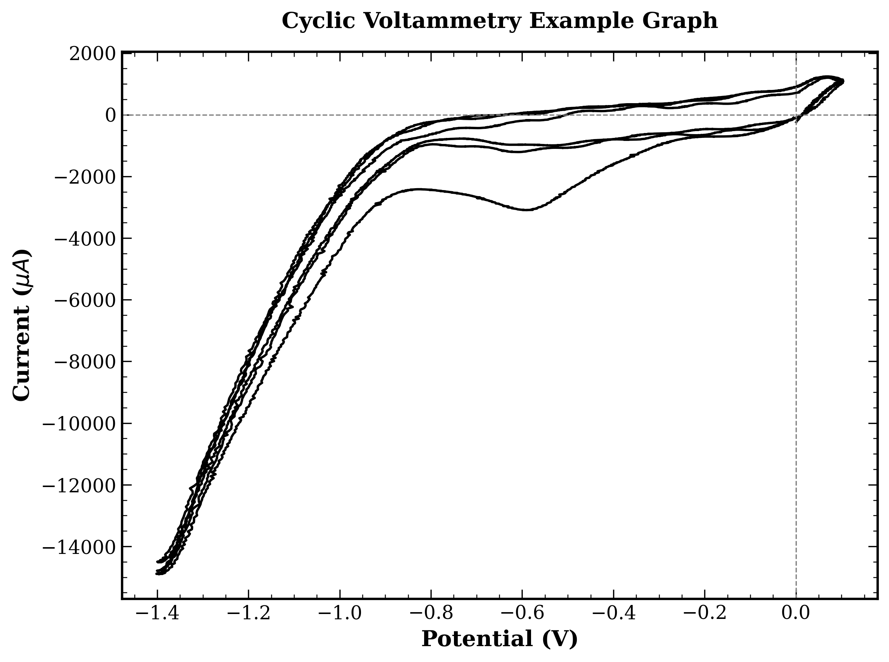

# Data Collection, Analysis & Interpretation
*Part 3: From Raw Data to Chemical Insight*

---

## 1. The Three Pillars of Analysis
To evaluate the success of a CO2 reduction experiment, researchers focus on three primary performance metrics. Data collection is designed to answer these three questions:

1.  **Activity (Speed):** *How fast is the reaction occurring?*
    *   In chemistry, we usually measure reaction rates in Moles/Second. In electrochemistry, we measure this from the Current. Higher current equals faster fuel production.

2.  **Selectivity (Purity):** *What product are we making?*
    *   Electricity can create many different things, so we need to determine what percentage of the electrons actually went into the desired target product.

3.  **Stability (Durability):** *How long does the catalyst last?*
    *   A catalyst works very fast for the first 10 seconds but dies out afterward is useless. We analyze stability by monitoring how the Activity and Selectivity change over time.
  
These 3 pillars will be expanded later, but for now just keep in mind that we need these three things from the data that you will be collecting.

---

## 2. Data Collection
A dataset typically requires the collection of three distinct metrics.

### A. Electrical Data
These data are usually automatically provided by the potentiostat or multimeter.
*   **Current ($I$):** The rate of electron flow, measured in Amperes (A) or Milliamperes (mA).
*   **Voltage ($V$):** The driving force, measured in Volts (V).
*   **Time ($t$):** The duration of the electrolysis (Seconds).
*   **Total Charge ($Q$):** The total electron count ($Q = I \times t$).

### B. Physical Data
*   **Electrode Surface Area ($A$):** The geometric area of the catalyst submerged in the electrolyte ($cm^2$).
*   This allows for the calculation of current density, enabling comparisons between different sized electrodes.

### C. Chemical Data
*   **Product Amount ($n$):** The actual quantity of fuel produced, measured in Moles.
*   This requires external detection methods which will be later discussed in Section 5.

---

## 3. Fundamental Constants & Stoichiometry
To convert electrical charge (Coulombs) into chemical mass (Moles), two constants are required.

### The Conversion Factor
**Faraday’s Constant ($F$)** represents the charge of one mole of electrons.
$$ F \approx 96,485 \ C/mol $$

### The Stoichiometric Constant ($z$)
Different products require different amounts of electrons to form. These values, denoted as $z$ (or $n$), will be used to calculate efficiency. Here are the table of some commonly found products from CO2 reduction reaction.

| Product | Chemical Formula | Electrons Required ($z$) | Phase |
| :--- | :--- | :---: | :--- |
| **Hydrogen** | $H_2$ | **2** | Gas |
| **Carbon Monoxide** | $CO$ | **2** | Gas |
| **Formate** | $HCOO^-$ | **2** | Liquid |
| **Methane** | $CH_4$ | **8** | Gas |
| **Ethylene** | $C_2H_4$ | **12** | Gas |
| **Ethanol** | $C_2H_5OH$ | **12** | Liquid |
| **Propanol** | $C_3H_7OH$ | **18** | Liquid |

The more electrons required, the more electricity used up per the same mole of product.

---

## 4. The Core Metrics
Once you have your raw data and your constants, you can calculate the two numbers that are actually report in a research paper: the current density and the faradaic efficiency.

### A. Measuring Activity: Current Density ($j$)
Raw current is misleading. Of course, a massive sheet of copper will pass more current than a tiny wire; therefore, to compare your catalyst fairly against other researchers, the surface area must be normallized.

**The Formula:**
$$ j = \frac{I}{A} $$

*   **$j$:** Current Density ($mA/cm^2$)
*   **$I$:** Current (mA)
*   **$A$:** Surface Area of the electrode ($cm^2$)

**Interpretation:**
*   **High $j$:** The material is highly active; the reaction is fast.
*   **Low $j$:** The material is sluggish; the reaction is slow.
The number will further depends on type and category of catalyst which can be further compare with other work of same kind or the control

### B. Measuring Selectivity: Faradaic Efficiency (FE)
This is one of the critical if not the most critical calculation in $CO_2$ reduction. It tells you the percentage of electrons that were successfully used to create your desired product, versus those wasted on unwanted side reactions.

**The Formula:**
$$ FE = \frac{n \times z \times F}{Q} \times 100 $$

*   **$n$:** Moles of product produced.
*   **$z$:** Electrons required per molecule (from the Reference Table).
*   **$F$:** Faraday’s Constant ($96,485 \ C/mol$).
*   **$Q$:** Total Charge passed ($Current \times Time$).

**Example:**
If you ran 100 Coulombs of charge ($Q$) and produced a small amount of Methane, you plug the moles of Methane into $n$, use 8 for $z$, and calculate.
*   **FE = 80%:** The catalyst is excellent.
*   **FE = 1%:** The catalyst is mostly just making waste.

---

## 4. The Collection Protocol
Before diving into the experiment, you must establish a strict routine for when and how you collect data. Because all datas are different, they require different sampling strategies.

### A. The Geometric Surface Area ($A_{geo}$)
*   **Timing:** Before the experiment.
*   **The Problem:** Current Density ($j$) depends entirely on this number. Most standard benchmarks in the field are reported in $mA/cm^2_{geo}$ (Geometric Surface Area).
*   **The Protocol:**
    1.  Measure the width of your copper strip with digital calipers.
    2.  Mark the depth of immersion (how deep it goes into the water).
    3.  **The Formula:** $$ Area = Width \times Depth \times 2 $$
    *   *Note:* 1. We multiply by 2 because the foil has two sides reacting with the liquid; however, you can also tape a non conductive tape to define your surface area. 2. This method does not account for microscopic roughness (ECSA). While advanced studies calculate "Specific Activity" using capacitance ($C_{dl}$), for high school and general engineering purposes, Geometric Area is the standard.

### B. Gas Sampling Strategy
*   **Timing:** Every 15 to 20 minutes (e.g., T=20, T=40, T=60).
*   **The Logic:** Unlike liquids, gas products flow out of the cell and are lost to the exhaust.
    *   **The Logic:** A GC injection captures the instantaneous production rate at that specific moment. By sampling multiple times, you can also prove that the catalyst isn't dying. If the T=20 sample has high methane but T=60 has zero, the catalyst has deactivated.

### C. Liquid Sampling Strategy (Accumulation)
*   **Timing:** At the very end (T=Final).
*   **The Logic:** Liquid products (Formate, Ethanol) remain trapped in the electrolyte.
    *   **The Cumulative Average:** We typically analyze the liquid after the experiment is finished. This tells us the average production rate over the entire hour.
    *   *Why not sample often?* Removing liquid during the run changes the volume of the electrolyte, which can alter the resistance and concentration, introducing error.

### D. Electrical Sampling (Continuous)
*   **Timing:** Continuous (Sampling rate: ~1 point per second).
*   **The Protocol:** The potentiostat logs the current automatically. But be sure to monitor the live graph for Noise. Sudden spikes or drops often indicate a bubble blocking the electrode or a loose wire connection.

*Note: While these are the standard protocols, every experiment is unique. Ensure your sampling method is consistent across all trials to avoid bias.*

---

## 5. Product Detection
The most common beinner's misconception is thinking that the we can tell what products we made from the current alone. But in truth, the machine doesn't know if those electrons made Methane, Carbon Monoxide, or just Hydrogen. To find the moles for your efficiency calculation, you need a separate detection method. To find the moles for the efficiency calculation, you must analyze both the gas coming out of the cell and the liquid electrolyte inside the cell.

### A. The Professional Standards
If you read a paper in *Nature* or *Science*, they use separate instruments for each phase.

**1. For Gas Products (e.g. $CO, CH_4, H_2, C_2H_4$):**
*   **Instrument:** Gas Chromatography (GC).
*   **How it works:** Use a syringe to take gas from the head space after running CA; then, inject the gas stream into a long column. Different gases move at different speeds, so the detector detects them at different time disinguising the gases.
*   **Result:** Peaks showing how many micromoles of each gas were created.

*Figure : Typical chromatograms showing separation of gases. Top: TCD detector for inorganic gases. Bottom: FID detector for hydrocarbons.*

**2. For Liquid Products (e.g. Formate, Ethanol, Propanol):**
*   **Instrument:** Nuclear Magnetic Resonance (NMR) or High-Performance Liquid Chromatography (HPLC).
*   **How it works:** You take a small sample of your electrolyte water after the experiment.
    *   *NMR:* Uses magnetic fields to identify specific carbon-hydrogen bonds (e.g., distinguishing the $CH_3$ group in Ethanol from the $H-C$ bond in Formate).
    *   *HPLC:* Separates chemical compounds in the liquid based on how they stick to a filter column.
*   **Result:** A concentration reading of the compounds found in the solution

*Figure : An example 1H-NMR spectrum. Note the large water peak (suppressed) relative to the small product peaks.*

*Figure 3: A standard calibration curve converting peak area into concentration.*

### B. Resource-limited alternative settings
High school and undergraduate laboratories often lack access to chromatography or spectroscopy. In these scenarios, researchers can adapt classical chemical methods to gather useful, albeit less specific, data.

**1. Volumetric Analysis**
If distinguishing between Hydrogen and Carbon Monoxide is not possible, one can focus on the total reaction rate.
*   **The Concept:** By capturing the total volume of gas evolved over a specific time period, researchers can compare the *actual* gas volume produced against the *theoretical* volume predicted by Faraday’s Law.
*   **The Insight:** While this does not identify the specific product, it confirms whether the system is acting efficiently or if electrons are being lost to non-gaseous side reactions.

**2. Wet Chemical Quantification**
Liquid products like Formate or Ethanol act as reducing agents.
*   **The Concept:** Classical titration methods using strong oxidizers (such as Permanganate or Dichromate) can be used to estimate the total concentration of organic compounds in the electrolyte.
*   **The Insight:** This provides a quantitative measure of total organic liquid products, which is often sufficient for preliminary screening of catalysts like Tin or Zinc.

**3. Solid-State Gas Sensing**
Modern air quality monitoring technology has made specific gas detection more accessible.
*   **The Concept:** Metal-oxide semiconductor sensors (commonly used in safety alarms) react specifically to Carbon Monoxide or combustible gases.
*   **The Insight:** While these sensors typically lack the high resolution of a GC, they can provide semi-quantitative data (Parts Per Million) to confirm that Carbon Monoxide is being produced, distinguishing a successful CO2 reduction from a simple Hydrogen evolution reaction.

---

## 6. Case Study: A Real Calculation Walkthrough
Let's look at a hypothetical experiment to see how we go from raw numbers to a final percentage.

### The Scenario
You are testing a Silver (Ag) catalyst to produce Carbon Monoxide (CO). You run the experiment for 30 minutes.

### Step 1: Gather the Raw Data
Here is what you measured in the lab:
*   **Average Current ($I$):** 50 mA (milliamps)
*   **Time ($t$):** 1800 seconds (30 mins)
*   **Electrode Area ($A$):** 2.5 $cm^2$
*   **Product Detected ($n$):** The GC tells you that you made 150 micromoles ($\mu mol$) of CO gas.

### Step 2: Calculate Activity (Current Density)
First, we normalize the current to see how fast the reaction ran per unit area.
$$ j = \frac{I}{A} = \frac{50 \ mA}{2.5 \ cm^2} = \mathbf{20 \ mA/cm^2} $$
*Result:* This is a decent reaction rate for a student setup.

### Step 3: Calculate Selectivity (Faradaic Efficiency)
Now, we find out what percentage of the electricity actually made the CO.

**A. Calculate Total Electrical Charge ($Q_{total}$)**
Convert mA to Amps first.
$$ Q = I \times t = 0.050 \ A \times 1800 \ s = \mathbf{90 \ Coulombs} $$

**B. Calculate Chemical Charge ($Q_{product}$)**
How much charge is "stored" in the CO?
*   Target: CO
*   Electrons required ($z$): 2 (from the Table earlier)
*   Moles ($n$): $150 \mu mol = 0.000150 \ mol$
*   Faraday ($F$): $96,485 \ C/mol$

$$ Q_{product} = n \times z \times F $$
$$ Q_{product} = 0.000150 \times 2 \times 96,485 = \mathbf{28.95 \ Coulombs} $$

**C. The Final Ratio**
$$ FE = \frac{Q_{product}}{Q_{total}} \times 100 $$
$$ FE = \frac{28.95}{90} \times 100 = \mathbf{32.1\%} $$

### The Interpretation
You have 32% Faradaic Efficiency for CO. And since Silver mostly makes CO and Hydrogen, the remaining 68% of the electrons likely went into making Hydrogen gas.

*Figure : The "Kuhl Plot." This stacked chart shows how product selectivity changes as you increase voltage. Notice how Hydrogen (Grey) decreases as Methane (Blue) increases.*

---

## 7. Visualizing the Data in Graph
Countless of numbers collected from the instrument don't tell us the whole story; we need to connect the dots and interpret the whole reaction. To understand how a catalyst behaves, we plot current, voltage and time.

### A. The Sweep Techniques: LSV and CV
These are the first experiments you run to see if your catalyst is working. You vary the voltage and measure the current output.

**1. Linear Sweep Voltammetry (LSV)**
*   **The Action:** The potentiostat scans the voltage in one direction (e.g., from 0V down to -2.0V).
*   **The Result:** A graph where the current stays near zero until a specific voltage, then drastically shoots down. This is because a reaction has its own specific minimum for the reaction to proceed.
*   **Onset Potential:** This is the voltage where the current starts to rise meaning the reaction turns on. A more positive onset potential is better as it can be inferred the reaction needs less energy to start. (Note that positive is less energy as we are considering the reduction reaction where we look at negative potentials)

*Figure : A Linear Sweep Voltammetry (LSV) scan. The "knee" of the curve indicates where the reaction turns on.*

**2. Cyclic Voltammetry (CV)**
*   **The Action:** The potentiostat scans the voltage down and then back up in a loop (0V $\rightarrow$ -2.0V $\rightarrow$ 0V).
*   **The Result:** A supposedly Duck-shaped loop, but the shape can varies with the experiments and conditions.
*   **The Difference:** While LSV just shows performance, CV is a diagnostic tool. The shape tells you about the capacitance (surface area) and reversibility. If the graph looks totally different in a few loop, the catalyst might be unstable. This is why in research, they often run the loop many times to ensure stability and reproducibility.

So while CV offer more data to interpret, LSV maybe suited to some experiment such as experiment focusing on steady state behavior.

*Figure : A Cyclic Voltammetry (CV) scan vs Ag/AgCl.*

### B. Chronoamperometry (CA)
LSV and CV only last a few seconds. To measure products, you need to run the reaction for a longer period.

*   **The Action:** Hold the voltage constant (e.g. -1.0V) and record current over time.
*   **The Graph:**
    *   **X-Axis:** Time (Seconds)
    *   **Y-Axis:** Current Density ($mA/cm^2$)
*   **Interpretation:**
    *   **Flat Line:** Stable catalyst.
    *   **Declining Line:** The catalyst is unstable (e.g. being poisoned or falling off).

### C. Kinetic Analysis: The Tafel Plot
While an LSV and CV show you when the reaction starts, a Tafel Plot tells you how hard it is to drive the reaction faster. It connects the extra energy you apply (Overpotential) to the speed you get out (Log Current).

*   **The Graph**
    *   **Y-Axis:** Overpotential ($\eta$) in Volts (How much extra push you are giving).
    *   **X-Axis:** Logarithm of Current Density ($\log j$).
    *   **The Slope (The "Tafel Slope"):** It is the most important number measured in mV/decade (millivolts needed to increase current by 10x).
    *   **Small Slope (e.g., 30-40 mV/dec):** Excellent. A tiny increase in voltage gives a huge boost in current.
    *   **Large Slope (e.g., 120 mV/dec):** Poor. You have to push very hard to get a small increase in speed.

*Note: on how to do the tafel plot, please find guidelines on trusted resources such as electrochemistry textbooks and educational website* 

*Figure : A Tafel Plot comparing two catalysts. The Blue line has a smaller slope, meaning it is kinetically faster and more efficient than the Red line.*

---

## 8. Conclusion
Data analysis is something that is not only done at the end of the experiments but dictates what the next step in the experiment is as well. This is a simple workflow for the data collection and analysis in general study CO2 reduction reaction:

1.  **Measuring the surface area:** Before starting, measure the Surface Area of your working electrode.
2.  **Diagnostic Check (CV):** Run a Cyclic Voltammetry scan to see if the electrode is clean.
3.  **Performance Check (LSV):** Run a Linear Sweep Voltammetry to find the Onset Potential.
4.  **Production Run (Chronoamperometry):** Pick a voltage and hold for a period of time.
    *   *Action:* During this hour, collect gas samples (if using GC) or wait to sample the liquid (if analyzing liquids).
5.  **The Calculation:**
    *   Take the average Current ($I$) from Step 4.
    *   Divide by Area to get Current Density ($j$).
    *   Quantify product moles ($n$) using your selected detection method.
    *   Calculate Faradaic Efficiency ($FE$).
6.  **Report:**
    *   The Current Density graph to show Activity.
    *   The FE bar chart to show Selectivity.  
