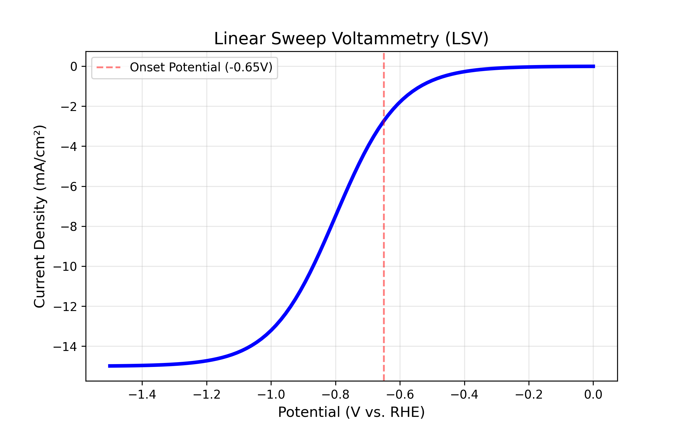
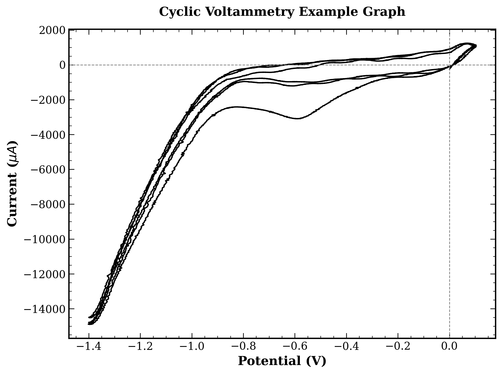

<!-- Paste this part exactly where you want the Table of Contents to appear! -->

<h4>Table of Contents</h4>

* TOC
{:toc}

# Data Collection, Analysis & Interpretation
*Part 3: From Raw Data to Chemical Insight*

---

## 1. The Big Picture

### 1.1 Three Pillars of Analysis
To evaluate the success of a CO2 reduction experiment, researchers focus on three primary performance metrics. Data collection is designed to answer these three questions:

1.  **Activity (Speed):** *How fast is the reaction occurring?*
    *   In chemistry, we usually measure reaction rates in Moles/Second. In electrochemistry, we measure this from the Current. Higher current equals faster fuel production.

2.  **Selectivity (Purity):** *What product are we making?*
    *   Electricity can create many different things, so we need to determine what percentage of the electrons actually went into the desired target product.

3.  **Stability (Durability):** *How long does the catalyst last?*
    *   A catalyst works very fast for the first 10 seconds but dies out afterward is useless. We analyze stability by monitoring how the Activity and Selectivity change over time. 

### 1.2 Datas We Need to Collect
A dataset typically requires the collection of three distinct metrics.

### A. Electrical Data
These data are usually automatically provided by the potentiostat or multimeter.
*   **Current ($I$):** The rate of electron flow, measured in Amperes (A) or Milliamperes (mA).
*   **Voltage ($V$):** The driving force, measured in Volts (V).
*   **Time ($t$):** The duration of the electrolysis (Seconds).
*   **Total Charge ($Q$):** The total electron count ($Q = I \times t$).

### B. Physical Data
*   **Electrode Surface Area ($A$):** The geometric area of the catalyst submerged in the electrolyte ($cm^2$).
*   This allows for the calculation of current density, enabling comparisons between different sized electrodes.

### C. Chemical Data
*   **Product Amount ($n$):** The actual quantity of fuel produced, measured in Moles.
*   This requires external detection methods.

---

## 2. The Data Collection Protocol
Before diving into the experiment, you must establish a strict routine for when and how you collect data. Because all datas are different, they require different sampling strategies.

### A. The Geometric Surface Area ($A_{geo}$)
*   **Timing:** Before the experiment.
*   **The Problem:** Current Density ($j$) depends entirely on this number. Most standard benchmarks in the field are reported in $mA/cm^2_{geo}$ (Geometric Surface Area).
*   **The Protocol:**
    1.  Measure the width of your copper strip with digital calipers.
    2.  Mark the depth of immersion (how deep it goes into the water).
    3.  **The Formula:** $$ Area = Width \times Depth \times 2 $$
    *   *Note: 1. We multiply by 2 because the foil has two sides reacting with the liquid; however, you can also tape a non conductive tape to define your surface area. 2. This method does not account for microscopic roughness (ECSA). While advanced studies calculate "Specific Activity" using capacitance ($C_{dl}$), for high school and general engineering purposes, Geometric Area is the standard.*

### B. Gas Sampling Strategy
*   **Timing:** Every 15 to 20 minutes (e.g., T=20, T=40, T=60).
*   **The Logic:** Unlike liquids, gas products flow out of the cell and are lost to the exhaust.
    *   **The Logic:** A GC injection captures the instantaneous production rate at that specific moment. By sampling multiple times, you can also prove that the catalyst isn't dying. If the T=20 sample has high methane but T=60 has zero, the catalyst has deactivated.

### C. Liquid Sampling Strategy (Accumulation)
*   **Timing:** At the very end (T=Final).
*   **The Logic:** Liquid products (Formate, Ethanol) remain trapped in the electrolyte.
    *   **The Cumulative Average:** We typically analyze the liquid after the experiment is finished. This tells us the average production rate over the entire hour.
    *   *Why not sample often?* Removing liquid during the run changes the volume of the electrolyte, which can alter the resistance and concentration, introducing error.

### D. Electrical Sampling (Continuous)
*   **Timing:** Continuous (Sampling rate: ~1 point per second).
*   **The Protocol:** The potentiostat logs the current automatically. But be sure to monitor the live graph for Noise. Sudden spikes or drops often indicate a bubble blocking the electrode or a loose wire connection.

*Note: While these are the standard protocols, every experiment is unique. Ensure your sampling method is consistent across all trials to avoid bias.*

---

## 3. Electrical Data
Countless of numbers collected from the instrument don't tell us the whole story; we need to connect the dots and interpret the whole reaction. To understand how a catalyst behaves, we plot current, voltage and time. These data are collected via the potentiostat which connects to your system. By altering the program in the potentiostat, you can apply voltage and acquire data in diffrent patterns. The three main techniques are:

### 3.1 Linear Sweep Voltammetry (LSV)

LSV is the standard method to determine how fast your reaction is occurring and at what voltage it begins.

*   **Concept:** The potentiostat scans the voltage from a starting point (e.g., 0V) to an end point (e.g., -1.5V) in a single direction. As the voltage becomes more negative, the current should increase, indicating that the reduction reaction is happening faster.
*   **Insight:** We plot this as Current Density (j) on the Y-axis against Voltage (V) on the X-axis. This normalizes the result so you can compare a small wire electrode to a large plate electrode fairly.

#### Interpretation
1.  **Onset Potential:** Look at the specific voltage where the current starts to drop sharply. A less negative onset potential is better. For example, if Catalyst A starts reacting at -0.5V and Catalyst B starts at -0.8V, Catalyst A is more energy efficient.
2.  **Argon vs. CO2 Baseline:** To prove your catalyst is actually reducing CO2 and not just splitting water, you should run one LSV in an inert gas like Argon or Nitrogen first. Then, run a second LSV in CO2. If the CO2 line shows significantly more current than the Argon line, your catalyst is active for CO2 reduction.

*Figure : A Linear Sweep Voltammetry (LSV) scan. The "knee" of the curve indicates where the reaction turns on.*

  <h4 style="margin-top: 0; text-align: center;">Interactive LSV: Argon Baseline vs. CO₂ Scan</h4>
  

    <em>💡 <strong>Interactive:</strong> Click the colored boxes in the legend below to toggle the curves on and off!</em>
  

  <canvas id="lsvChart"></canvas>

---

### 3.2 Cyclic Voltammetry (CV)

CV is used to diagnose the health and surface properties of your electrode. Unlike LSV, this method cycles the voltage back and forth multiple times. 

*   **Concept:** The voltage is scanned down to a negative limit and then immediately scanned back up to the start. This creates a loop on the graph. The shape of this loop acts as a fingerprint for your electrode's surface state.
*   **Insight:** We use CV to check for stability. By running the cycle multiple times (e.g., 50 cycles), we can see if the electrode is degrading or changing over time.

#### Interpretation
1.  **Stability Check:** Compare the loop of the 1st cycle with the loop of the 50th cycle. Ideally, they should overlap perfectly. If the loops are shrinking or shifting position, it means your catalyst is unstable, falling off the electrode, or getting poisoned by contaminants.
2.  **Double Layer Capacitance:** Look at the width or thickness of the loop in the middle region where it is relatively flat. A wider loop generally indicates a higher electrochemical surface area. This suggests your electrode has a rougher surface, which often provides more active sites for the reaction to take place.

*Figure : A Cyclic Voltammetry (CV) scan vs Ag/AgCl.*

### 3.3 Chronoamperometry (CA)

CA is the endurance test for your system. While LSV tells you how fast the reaction can go, CA tells you if it can keep going.

*   **Concept:** Instead of scanning the voltage, we hold the potential constant at a specific value (e.g., -1.0 V vs RHE) and measure the current over a long period, typically 1 to 12 hours.
*   **Insight:** This is the phase where you actually collect your products. By integrating the current over time, you calculate the Total Charge (Q), which serves as the baseline for your Faradaic Efficiency calculations.

#### Interpretation
**Current Stability:** Look at the general trend of the line over the duration of the experiment.
    *   **Ideal:** A flat, horizontal line. This means your electrode is stable and performing consistently.
    *   **Degrading:** A line that slowly curves upwards towards zero (current magnitude decreases). This usually indicates your catalyst is peeling off, dissolving, or being poisoned by contaminants in the electrolyte.

---

## 4. Product Detection
The potentiostat itself doesn't know if the electrons made Methane, Carbon Monoxide, or just Hydrogen. To find the moles for your efficiency calculation, you need a separate detection method. To find the moles for the efficiency calculation, you must analyze both the gas coming out of the cell and the liquid electrolyte inside the cell.

### 4.1. The Professional Standards
If you read a paper in *Nature* or *Science*, they use separate instruments for each phase.

**1. For Gas Products (e.g. $CO, CH_4, H_2, C_2H_4$):**
*   **Instrument:** Gas Chromatography (GC).
*   **How it works:** Use a syringe to take gas from the head space after running CA; then, inject the gas stream into a long column. Different gases move at different speeds, so the detector detects them at different time disinguising the gases.
*   **Result:** Peaks showing how many micromoles of each gas were created.

**2. For Liquid Products (e.g. Formate, Ethanol, Propanol):**
*   **Instrument:** Nuclear Magnetic Resonance (NMR) or High-Performance Liquid Chromatography (HPLC).
*   **How it works:** You take a small sample of your electrolyte water after the experiment.
    *   *NMR:* Uses magnetic fields to identify specific carbon-hydrogen bonds (e.g., distinguishing the $CH_3$ group in Ethanol from the $H-C$ bond in Formate).
    *   *HPLC:* Separates chemical compounds in the liquid based on how they stick to a filter column.
*   **Result:** A concentration reading of the compounds found in the solution

*Figure 3: A standard calibration curve converting peak area into concentration.*

  

    <h3 style="margin: 0;">Interactive ¹H NMR Spectrum (Liquid Products)</h3>
    
Standard 1D Proton NMR in D₂O solvent

  

  
  

    <svg viewBox="0 0 800 300" width="100%" height="300">
      <!-- Gridlines -->
      <line x1="0" y1="50" x2="800" y2="50" stroke="#f0f0f0" stroke-width="1"/>
      <line x1="0" y1="100" x2="800" y2="100" stroke="#f0f0f0" stroke-width="1"/>
      <line x1="0" y1="150" x2="800" y2="150" stroke="#f0f0f0" stroke-width="1"/>
      <line x1="0" y1="200" x2="800" y2="200" stroke="#f0f0f0" stroke-width="1"/>

      <!-- X Axis (0 to 10 ppm, standard NMR goes Right to Left) -->
      <line x1="20" y1="250" x2="780" y2="250" stroke="#333" stroke-width="2"/>
      
      <!-- Axis Labels & Ticks (Every 1 ppm) -->
      <g font-size="12" fill="#666" text-anchor="middle">
        <line x1="40" y1="250" x2="40" y2="255" stroke="#333"/><text x="40" y="270">10</text>
        <line x1="114" y1="250" x2="114" y2="255" stroke="#333"/><text x="114" y="270">9</text>
        <line x1="188" y1="250" x2="188" y2="255" stroke="#333"/><text x="188" y="270">8</text>
        <line x1="262" y1="250" x2="262" y2="255" stroke="#333"/><text x="262" y="270">7</text>
        <line x1="336" y1="250" x2="336" y2="255" stroke="#333"/><text x="336" y="270">6</text>
        <line x1="410" y1="250" x2="410" y2="255" stroke="#333"/><text x="410" y="270">5</text>
        <line x1="484" y1="250" x2="484" y2="255" stroke="#333"/><text x="484" y="270">4</text>
        <line x1="558" y1="250" x2="558" y2="255" stroke="#333"/><text x="558" y="270">3</text>
        <line x1="632" y1="250" x2="632" y2="255" stroke="#333"/><text x="632" y="270">2</text>
        <line x1="706" y1="250" x2="706" y2="255" stroke="#333"/><text x="706" y="270">1</text>
        <line x1="780" y1="250" x2="780" y2="255" stroke="#333"/><text x="780" y="270">0</text>
        <text x="410" y="290" font-weight="bold" fill="#333">Chemical Shift (ppm)</text>
      </g>

      <!-- Simulated NMR Spectrum Curve -->
      <polyline points="
        20,248 140,248 
        150,248 155,50 160,248 
        370,248 
        415,248 425,120 435,248 
        520,248 
        530,248 533,100 536,248 
        625,248 
        636,248 639,150 642,248 
        680,248 
        690,248 693,190 696,248 
        700,248 703,140 706,248 
        710,248 713,190 716,248 
        770,248 778,180 782,248 790,248
      " fill="none" stroke="#2e7d32" stroke-width="2.5" stroke-linejoin="round"/>

      <!-- Interactive Hotspots (Clickable Areas) -->
      <!-- Formate ~8.44 ppm -->
      <rect class="peak-hotspot" x="140" y="30" width="30" height="220" onclick="showPeak('formate')"/>
      <text x="155" y="20" font-size="12" fill="#1976d2" font-weight="bold" text-anchor="middle" pointer-events="none">8.44</text>

      <!-- Water/HDO ~4.79 ppm -->
      <rect class="peak-hotspot" x="410" y="100" width="40" height="150" onclick="showPeak('water')"/>
      <text x="430" y="90" font-size="12" fill="#1976d2" font-weight="bold" text-anchor="middle" pointer-events="none">4.79</text>

      <!-- Methanol ~3.34 ppm -->
      <rect class="peak-hotspot" x="518" y="80" width="30" height="170" onclick="showPeak('methanol')"/>
      <text x="533" y="70" font-size="12" fill="#1976d2" font-weight="bold" text-anchor="middle" pointer-events="none">3.34</text>

      <!-- Acetate ~1.90 ppm -->
      <rect class="peak-hotspot" x="624" y="130" width="30" height="120" onclick="showPeak('acetate')"/>
      <text x="639" y="120" font-size="12" fill="#1976d2" font-weight="bold" text-anchor="middle" pointer-events="none">1.90</text>

      <!-- Ethanol ~1.17 ppm -->
      <rect class="peak-hotspot" x="680" y="120" width="45" height="130" onclick="showPeak('ethanol')"/>
      <text x="703" y="110" font-size="12" fill="#1976d2" font-weight="bold" text-anchor="middle" pointer-events="none">1.17</text>

      <!-- TMS Standard ~0.00 ppm -->
      <rect class="peak-hotspot" x="765" y="160" width="30" height="90" onclick="showPeak('tms')"/>
      <text x="780" y="150" font-size="12" fill="#1976d2" font-weight="bold" text-anchor="middle" pointer-events="none">0.00</text>

    </svg>
  

  
  
👆 Click the highlighted boxes over the peaks! 👆

  

    <h3 class="nmr-title">Awaiting Selection...</h3>
    
Click any of the highlighted peaks on the spectrum above to identify the molecule and understand its signature.

  

### 4.2. Resource-limited alternative settings
High school and undergraduate laboratories often lack access to chromatography or spectroscopy. In these scenarios, researchers can adapt classical chemical methods to gather useful, albeit less specific, data.

**1. Volumetric Analysis**
If distinguishing between Hydrogen and Carbon Monoxide is not possible, one can focus on the total reaction rate.
*   **The Concept:** By capturing the total volume of gas evolved over a specific time period, researchers can compare the *actual* gas volume produced against the *theoretical* volume predicted by Faraday’s Law.
*   **The Insight:** While this does not identify the specific product, it confirms whether the system is acting efficiently or if electrons are being lost to non-gaseous side reactions.

**2. Wet Chemical Quantification**
Liquid products like Formate or Ethanol act as reducing agents.
*   **The Concept:** Classical titration methods using strong oxidizers (such as Permanganate or Dichromate) can be used to estimate the total concentration of organic compounds in the electrolyte.
*   **The Insight:** This provides a quantitative measure of total organic liquid products, which is often sufficient for preliminary screening of catalysts like Tin or Zinc.

**3. Solid-State Gas Sensing**
Modern air quality monitoring technology has made specific gas detection more accessible.
*   **The Concept:** Metal-oxide semiconductor sensors (commonly used in safety alarms) react specifically to Carbon Monoxide or combustible gases.
*   **The Insight:** While these sensors typically lack the high resolution of a GC, they can provide semi-quantitative data (Parts Per Million) to confirm that Carbon Monoxide is being produced, distinguishing a successful CO2 reduction from a simple Hydrogen evolution reaction.

**4. Water Displacement**
We can actually measure the gas volume by using the concept of displacement.
*   **The Concept:** Connect the gas outlet of your cell to a tube positioned inside an inverted, water-filled graduated cylinder. As gas is produced, it displaces the water, allowing you to measure the exact volume of gas generated over time.
*   **The Insight:** This acts as a crucial sanity check for mass balance. If the volume of gas collected is significantly lower than the theoretical volume calculated from the current passed, you likely have a gas leak in your setup or are producing liquid products instead.

---

## 5. Calculating Performance

### 5.1 The Two key Metrics
Once you have your raw data, you can calculate the two numbers that are actually report in a research paper: the current density and the faradaic efficiency.

#### A. Measuring Activity: Current Density ($j$)
Raw current is misleading. Of course, a massive sheet of copper will pass more current than a tiny wire; therefore, to compare your catalyst fairly against other researchers, the surface area must be normallized.

**The Formula:**
$$ j = \frac{I}{A} $$

*   **$j$:** Current Density ($mA/cm^2$)
*   **$I$:** Current (mA)
*   **$A$:** Surface Area of the electrode ($cm^2$)

**Interpretation:**
*   **High $j$:** The material is highly active; the reaction is fast.
*   **Low $j$:** The material is sluggish; the reaction is slow.
The number will further depends on type and category of catalyst which can be further compare with other work of same kind or the control

#### B. Measuring Selectivity: Faradaic Efficiency (FE)
This is one of the critical if not the most critical calculation in $CO_2$ reduction. It tells you the percentage of electrons that were successfully used to create your desired product, versus those wasted on unwanted side reactions.

**The Formula:**
$$ FE = \frac{n \times z \times F}{Q} \times 100 $$

*   **$n$:** Moles of product produced.
*   **$z$:** Electrons required per molecule (from the Reference Table below).
*   **$F$:** Faraday’s Constant ($96,485 \ C/mol$).
*   **$Q$:** Total Charge passed ($Current \times Time$).

**Reference Table**

| Product | Chemical Formula | Electrons Required ($z$) | Phase |
| :--- | :--- | :---: | :--- |
| **Hydrogen** | $H_2$ (waste) | **2** | Gas |
| **Carbon Monoxide** | $CO$ | **2** | Gas |
| **Formate** | $HCOO^-$ | **2** | Liquid |
| **Methane** | $CH_4$ | **8** | Gas |
| **Ethylene** | $C_2H_4$ | **12** | Gas |
| **Ethanol** | $C_2H_5OH$ | **12** | Liquid |
| **Propanol** | $C_3H_7OH$ | **18** | Liquid |

**Example:**
If you ran 100 Coulombs of charge ($Q$) and produced a small amount of Methane, you plug the moles of Methane into $n$, use 8 for $z$, and calculate.
*   **FE = 80%:** The catalyst is excellent.
*   **FE = 1%:** The catalyst is mostly just making waste.

---

### 5.2 Comprehensive Case Study

Let's walk through an experiment where we calculate both efficiency and selectivity from the data.

**The Scenario:**
*   **Total Current ($I_{total}$):** 10 mA ($0.010 A$)
*   **Duration ($t$):** 1 hour ($3600 s$)
*   **Electrode Area:** 2 cm²
*   **Electrolyte Volume ($V_{liq}$):** 30 mL ($0.030 L$)
*   **CO2 Flow Rate:** 10 sccm (mL/min)
*   **Gas Reading (GC):** 2000 ppm Carbon Monoxide (CO)
*   **Liquid Reading (NMR/HPLC):** 3 mM Formate

---

#### Part A: Gas Product Calculation
Gas is analyzed as a rate of production. We calculate this using the current at the specific moment of sampling.

**1. Convert Gas Flow to Molar Rate**
$$ \text{Flow}_{mol} = \frac{\text{Flow}_{mL/min}}{60 \times V_m} $$
*(Using $V_m = 24465$ mL/mol at 25°C)*
$$ \text{Flow}_{mol} = \frac{10}{60 \times 24465} \approx 6.81 \times 10^{-6} \text{ mol/s} $$

**2. Calculate Partial Current for CO ($I_{CO}$)**
CO requires 2 electrons ($z=2$).
$$ I_{CO} = z \times F \times (\text{Flow}_{mol} \times \text{Concentration}_{fraction}) $$
$$ I_{CO} = 2 \times 96485 \times (6.81 \times 10^{-6} \times 0.002) $$
$$ I_{CO} \approx 0.0026 \text{ A} = 2.6 \text{ mA} $$

**3. Calculate Gas Efficiency**
$$ FE_{CO} = \frac{2.6 \text{ mA}}{10 \text{ mA}} \times 100\% = 26\% $$

---

#### Part B: Liquid Product Calculation (Accumulated)
Liquid products accumulate over time. We calculate this using the total charge passed over the entire hour.

**1. Calculate Total Moles Produced**
$$ n_{formate} = \text{Concentration} \times \text{Volume} $$
$$ n_{formate} = 0.003 \text{ mol/L} \times 0.030 \text{ L} = 9.0 \times 10^{-5} \text{ mol} $$

**2. Calculate Charge Used for Formate ($Q_{formate}$)**
Formate requires 2 electrons ($z=2$).
$$ Q_{formate} = n \times z \times F $$
$$ Q_{formate} = (9.0 \times 10^{-5}) \times 2 \times 96485 \approx 17.4 \text{ C} $$

**3. Calculate Total Charge Passed ($Q_{total}$)**
$$ Q_{total} = I_{total} \times t $$
$$ Q_{total} = 0.010 \text{ A} \times 3600 \text{ s} = 36.0 \text{ C} $$

**4. Calculate Liquid Efficiency**
$$ FE_{formate} = \frac{17.4 \text{ C}}{36.0 \text{ C}} \times 100\% \approx 48.3\% $$

---

#### Part C: Overall System Performance
To report your final results, you combine the efficiencies and normalize the current.

*   **Faradaic Efficiency:** $26\% (CO) and 48.3\% (Formate)
    *(The remaining ~25.7% is likely Hydrogen evolution or resistive loss).*
*   **Current Density ($j$):**
    $$ j = \frac{I_{total}}{\text{Area}} = \frac{10 \text{ mA}}{2 \text{ cm}^2} = 5 \text{ mA/cm}^2 $$

  

    <h3 style="margin: 0;">⚡ Live Faradaic Efficiency Calculator ⚡</h3>
    
Tweak the lab parameters to see how it affects your results!

  

  

    

      <label for="calc-current">Total Current (mA)</label>
      <input type="number" id="calc-current" value="10" step="1" oninput="calculateFE()">
    

    

      <label for="calc-area">Electrode Area (cm²)</label>
      <input type="number" id="calc-area" value="1.0" step="0.1" oninput="calculateFE()">
    

    

      <label for="calc-ppm">GC Measurement: CO (ppm)</label>
      <input type="number" id="calc-ppm" value="2000" step="100" oninput="calculateFE()">
    

    

      <label for="calc-flow">CO₂ Flow Rate (sccm)</label>
      <input type="number" id="calc-flow" value="20" step="5" oninput="calculateFE()">
    

  

  

    

      

        
Current Density

        
10.0 mA/cm²

      

      

        
Faradaic Efficiency (CO)

        
52.6 %

      

    

    

      ⚠️ Warning: FE is over 100%. Check your inputs (or you just won a Nobel Prize).
    

  

---

## 6. Summary
Data analysis is something that is not only done at the end of the experiments but dictates what the next step in the experiment is as well. This is a simple workflow for the data collection and analysis in general study CO2 reduction reaction:

1.  **Measuring the surface area:** Before starting, measure the Surface Area of your working electrode.
2.  **Diagnostic Check (CV):** Run a Cyclic Voltammetry scan to see if the electrode is clean.
3.  **Performance Check (LSV):** Run a Linear Sweep Voltammetry to find the Onset Potential.
4.  **Production Run (Chronoamperometry):** Pick a voltage and hold for a period of time.
    *   *Action:* During this hour, collect gas samples (if using GC) or wait to sample the liquid (if analyzing liquids).
5.  **The Calculation:**
    *   Take the average Current ($I$) from Step 4.
    *   Divide by Area to get Current Density ($j$).
    *   Quantify product moles ($n$) using your selected detection method.
    *   Calculate Faradaic Efficiency ($FE$).
6.  **Report:**
    *   The Current Density graph to show Activity.
    *   The FE bar chart to show Selectivity.
  
---

### Bonus Kinetic Analysis: The Tafel Plot (Under Reconstruction)
While an LSV and CV show you when the reaction starts, a Tafel Plot tells you how hard it is to drive the reaction faster. It connects the extra energy you apply (Overpotential) to the speed you get out (Log Current).

*   **The Graph**
    *   **Y-Axis:** Overpotential ($\eta$) in Volts (How much extra push you are giving).
    *   **X-Axis:** Logarithm of Current Density ($\log j$).
    *   **The Slope (The "Tafel Slope"):** It is the most important number measured in mV/decade (millivolts needed to increase current by 10x).
    *   **Small Slope (e.g., 30-40 mV/dec):** Excellent. A tiny increase in voltage gives a huge boost in current.
    *   **Large Slope (e.g., 120 mV/dec):** Poor. You have to push very hard to get a small increase in speed.

*Note: on how to do the tafel plot, please find guidelines on trusted resources such as electrochemistry textbooks and educational website* 
