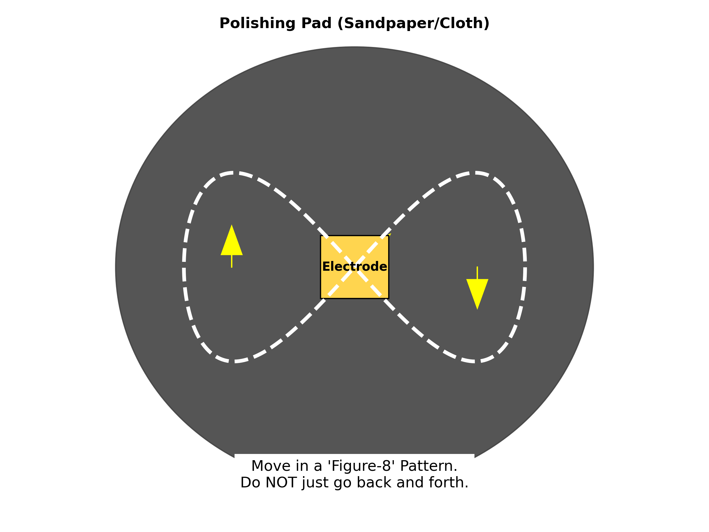
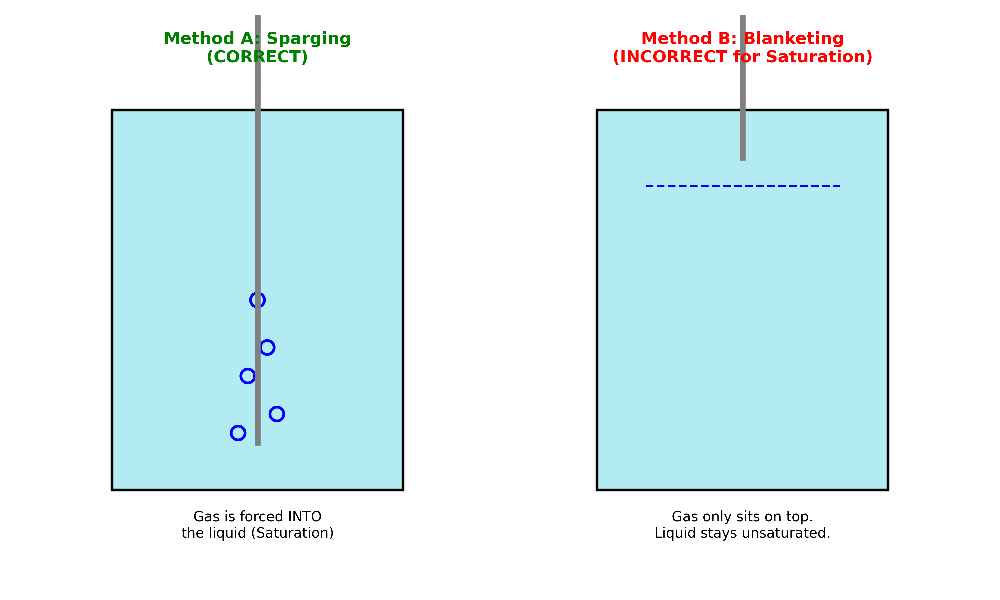

<!-- Paste this part exactly where you want the Table of Contents to appear! -->

<h4>Table of Contents</h4>

* TOC
{:toc}

# Experimental Design & Set Up
Part2: Analysis and Break Down of each Critical Component in Common Design.

---

## Safety & Operational Hazards
*Common protocols for handling gases and electricity.*

*   **Carbon Monoxide (CO) Toxicity:**
    *   *Risk:* The primary product of this reaction is CO, an odorless, colorless, and deadly gas.
    *   *Protocol:* Experiments should be conducted in a fume hood or a well-ventilated space equipped with CO detector.
*   **High-Pressure Cylinders:**
    *   *Risk:* $CO_2$ tanks contain massive pressure. If it leaked or valve tear, it becomes a big projectile
    *   *Protocol:* Cylinders should be chained/strapped to a wall or stable bench at all times. Not moving a tank without the safety cap screwed on.
*   **Alkaline Electrolytes:**
    *   *Risk:* Potassium Hydroxide ($KOH$) and Bicarbonate solutions can cause eye damage and skin irritation.
    *   *Protocol:* Chemical goggles and nitrile gloves to prevent any accidents.
*   **Electrical Safety in Wet Environments:**
    *   *Risk:* Saltwater is highly conductive. Spills near the power supply can cause short circuits.
    *   *Protocol:* Power supplies should be kept above the bench surface and ensure that all alligator clips are dry before turning on the voltage.
 
Note that these are just some common safety and protocal when working with CO2 reduction. There are other several guidlines which should always be looked up and followed for each chemical and instruments.

---

## 1. The Big Picture
For 90% of high school and undergraduate research, the standard design is the "H-Type Electrolytic Cell".

H-Type Electrolytic Cell or commonly called "H-cell" gets its name from its iconic look, two container and a bridge, thus calling it H-Cell.
Imagine two separate building connected by a bridge.
*   **Cathodic Chamber:** This is where the $$CO_2$$ reduction happens. It contains the Working Electrode and the $$CO_2$$ gas.
*   **Anodic Chamber:** This contains the Counter Electrode. Its job is just to complete the electrical circuit.
*   **The Membrane/Bridge:** This allows ions to flow between the chambers but stops the liquids and gases from mixing.

**Why separate them?**
If you put everything in one beaker, the oxygen produced in Anodic Chamber would float over to Chamber 1 and ruin your sensitive CO2 reaction. The "H" shape physically isolates these compounds while allowing electricity to flow and reactions to happen.

*(Note: There are also other types of Cells including Flow Cells and Single Cell. But, because Flow Cells are too advance and require expensive pumps and Single Cell will get all the liquid mixed up, we will left them out and focus on H-Cell. If you are interested, you can research further by looking into scientific papers regarding the Flow Cell pros, cons, and set up)*

---

## 2. The Hardware Setup
To perform CO2 reduction, you need a specific set of components arranged in a standard 3-Electrode System. This setup ensures we can control the voltage precisely while keeping the fuel products separate from the waste oxygen.

  

    <!-- Viewbox adjusted to give more breathing room on all sides -->
    <svg viewBox="0 -10 420 330" width="100%" height="100%">
      
      <!-- Liquid -->
      <path d="M 30 160 L 30 260 A 20 20 0 0 0 50 280 L 150 280 A 20 20 0 0 0 170 260 L 170 210 L 250 210 L 250 260 A 20 20 0 0 0 270 280 L 370 280 A 20 20 0 0 0 390 260 L 390 160 Z" fill="#e3f2fd" stroke="#2196f3" stroke-width="2"/>
      
      <!-- Glassware (H-Cell) -->
      <path d="M 30 90 L 30 260 A 20 20 0 0 0 50 280 L 150 280 A 20 20 0 0 0 170 260 L 170 210 L 250 210 L 250 260 A 20 20 0 0 0 270 280 L 370 280 A 20 20 0 0 0 390 260 L 390 90 M 170 160 L 170 90 M 250 160 L 250 90" fill="none" stroke="#9e9e9e" stroke-width="4" stroke-linecap="round"/>
      
      <!-- Bridge / Membrane -->
      <line class="hotspot" x1="210" y1="160" x2="210" y2="210" stroke="#ff9800" stroke-width="8" onclick="showInfo('membrane')"/>
      <text x="210" y="235" font-size="12" fill="#ff9800" font-weight="bold" text-anchor="middle" pointer-events="none">Membrane</text>

      <!-- Working Electrode (WE) -->
      <rect class="hotspot" x="55" y="70" width="15" height="150" fill="#795548" stroke="#5d4037" stroke-width="2" onclick="showInfo('we')"/>
      <text x="62.5" y="40" font-size="12" fill="#795548" font-weight="bold" text-anchor="middle">
        <tspan x="62.5" dy="0">WE</tspan>
        <tspan x="62.5" dy="14">(Cathode)</tspan>
      </text>

      <!-- Reference Electrode (RE) -->
      <rect class="hotspot" x="140" y="70" width="10" height="120" fill="#e0e0e0" stroke="#9e9e9e" stroke-width="2" onclick="showInfo('re')"/>
      <text x="145" y="40" font-size="12" fill="#616161" font-weight="bold" text-anchor="middle">
        <tspan x="145" dy="0">RE</tspan>
        <tspan x="145" dy="14">(Ag/AgCl)</tspan>
      </text>

      <!-- Bubbler -->
      <path class="hotspot" d="M 95 70 L 95 250 L 115 250 L 115 230 L 105 230 L 105 70 Z" fill="#b3e5fc" stroke="#0288d1" stroke-width="2" onclick="showInfo('bubbler')"/>
      <circle cx="102" cy="260" r="3" fill="#0288d1"/><circle cx="95" cy="270" r="4" fill="#0288d1"/><circle cx="110" cy="265" r="2.5" fill="#0288d1"/>
      <text x="105" y="20" font-size="12" fill="#0288d1" font-weight="bold" text-anchor="middle">
        <tspan x="105" dy="0">CO₂</tspan>
        <tspan x="105" dy="14">Gas</tspan>
      </text>

      <!-- Counter Electrode (CE) -->
      <rect class="hotspot" x="315" y="70" width="10" height="150" fill="#9e9e9e" stroke="#616161" stroke-width="2" onclick="showInfo('ce')"/>
      <line class="hotspot" x1="305" y1="190" x2="335" y2="190" stroke="#616161" stroke-width="2" onclick="showInfo('ce')"/>
      <line class="hotspot" x1="305" y1="200" x2="335" y2="200" stroke="#616161" stroke-width="2" onclick="showInfo('ce')"/>
      <line class="hotspot" x1="305" y1="210" x2="335" y2="210" stroke="#616161" stroke-width="2" onclick="showInfo('ce')"/>
      <text x="320" y="40" font-size="12" fill="#424242" font-weight="bold" text-anchor="middle">
        <tspan x="320" dy="0">CE</tspan>
        <tspan x="320" dy="14">(Anode - Pt)</tspan>
      </text>
      
      <!-- Instructions -->
      <text x="210" y="310" font-size="14" fill="#d32f2f" font-style="italic" text-anchor="middle" font-weight="bold">👆 Click the components above!</text>
    </svg>
  

  
  

    <h3 style="margin-top:0; font-size: 1.1rem; color: #1976d2;">Interactive H-Cell</h3>
    
Welcome to the standard H-Type Electrolytic Cell. This is the workhorse of CO₂ reduction research.

    
<strong>👈 Click on any part of the diagram</strong> (electrodes, membrane, bubbler) to learn its role.

  

  

    
Hardware Modules

    
Working Electrode (WE) ›

    
Counter Electrode (CE) ›

    
Reference Electrode (RE) ›

    
Ion Exchange Membrane ›

    
Electrolyte Solution ›

    
External Systems ›

  

  
  

    <!-- Dynamic content renders here via JavaScript -->
  

### Component Table

| **Component** | **Role** | **Standard Materials** |
| :--- | :--- | :--- |
| **Working Electrode (WE)** | This is the Cathode where CO2 reduction happens. | Copper Foil (Cu), Gold (Au), or Silver (Ag) |
| **Counter Electrode (CE)** | This is the Anode that completes the circuit (usually making Oxygen). | Platinum (Pt) Mesh or Wire |
| **Reference Electrode (RE)** | Measures the voltage accurately without passing current. | Ag/AgCl (Silver/Silver Chloride) |
| **H-Cells and External Supplies** | A two-chamber glass vessel and essential $CO_2$ and electricity sources. | Potentiostat, $CO_2$ Gas Tank |
| **Nafion Membrane** | Allows protons ($H^+$) to cross but stops fuel from mixing with oxygen. | Nafion 117 or 115 |
| **Electrolyte** | Conducts ions and holds the dissolved CO2. | 0.1M $KHCO_3$ (Potassium Bicarbonate) |

---

### 2.1 The Three Electrodes

#### 2.1.1 The Working Electrode (WE)

##### Role & Significance
The Working Electrode (Cathode) is the centerpiece of the experiment. It serves as the electron donor and the active site where the reduction reaction occurs. Connected to the negative terminal, most of the time, the Working Electrode is the catalyst. In electrochemistry, the material of the electrode dictates the entire reaction pathway. The specific atomic arrangement on the surface determines whether $CO_2$ is converted into Carbon Monoxide, Methane, or just Hydrogen gas. Therefore, the choice of the Working Electrode is the primary variable in any $$CO_2$$ reduction study.

##### Key Properties
1.  **Surface Morphology and Composition:** The roughness or nano-structure of the surface changes the local environment and the availability of reaction sites, often influencing the efficiency of the reaction. The purity of the metal is also critcal, and even trace of impurities can alter the product distribution.
2.  **Pretreatment and Modification:** There are multiples available modification of the metal before running the experiment. This affects the reaction widely and often change what product are produced.

##### Common Choices in Research
In this field, the WE varies by a lot to each researchers analyzing different materials. However, the most common working electrode are metals:
*   **Copper (Cu):** The most significant material in the field, as it is the only bulk metal capable of efficiently producing hydrocarbons (Ethylene, Ethanol).
*   **Other Transition Metals:** Au, Zn and Ag are commonly used to produce CO. And Sn and Bi are commonly used to produce Formate
These metals can undergoes several tuning and modifying as stated. The common example are: oxidizing metals to help increase its surface area and change the product distribution, replacing chunks of metal by their nano particles might improve their faradaic efficiency and supporting metals with structures like carbon could help in mass transport of $$CO_2$$.

---

#### 2.1.2 The Counter Electrode (CE)

##### Role & Significance
The Counter Electrode (Anode) completes the electrical circuit. While the focus of the experiment is on the cathode side, the anode is necessary for the system to fully function. Connected to the positive terminal, the Counter Electrode balances the reaction. For every electron consumed by the $CO_2$ reduction at the cathode, an oxidation reaction must occur here (typically splitting water into Oxygen).

##### Key Properties
1.  **Chemical Inertness:** The material must withstand high oxidation potentials without corroding. If it degrades or dissolves during the experiment, metal ions can cross the cell and contaminate the Working Electrode, making the data invalid.
2.  **Surface Area:** To ensure the Counter Electrode does not become a bottleneck, researchers ensure its surface area is significantly larger than that of the Working Electrode. This makes the test fair when compairing between Catalysts.

##### Common Choices in Research
*   **Platinum (Pt):** The academic standard due to its exceptional stability and conductivity, usually comes in form of wire or mesh.
*   **Graphite/Carbon:** A cost-effective alternative often used in educational settings, though it requires monitoring for degradation over long-term experiments.
*   **Dimensionally Stable Anodes (DSA):** Industrial-grade oxides (like Iridium Oxide) designed specifically for high-current durability.

---

#### 2.1.3 The Reference Electrode (RE)

##### Role & Significance
The Reference Electrode provides a stable, known voltage against which the Working Electrode is measured. In a standard 3-electrode setup, the Reference Electrode does not carry current. Its sole purpose is to sense the potential at the Working Electrode without interference from the Anode. Without a Reference Electrode, you will be measuring the voltage across the entire cell, which includes the wires and solution resistance, making it impossible to know exactly how much energy is being applied to the reaction itself.

##### Key Properties
1.  **Stability:** The potential of the reference must not change over time. If the reference move up or down by even 0.1V, the data becomes useless because you no longer know the true energy applied to the $CO_2$.
2.  **Impedance:** It must have a low-resistance connection to the electrolyte to ensure fast and accurate reading by the potentiostat.

##### Common Choices in Research
*   **Silver/Silver Chloride (Ag/AgCl):** The most common reference electrode for aqueous (water-based) experiments due to its stability and non-toxicity.
*   **Saturated Calomel Electrode (SCE):** An older standard using Mercury, but now has largely phased out due to toxicity concerns.
*   **Reversible Hydrogen Electrode (RHE):** This is the reference in theoryx. While researchers normally report data vs. RHE, they physically use an Ag/AgCl electrode in the lab and convert the numbers later through the equation below.

$$ E(RHE) = E(Ag/AgCl) + 0.197 V + (0.0591 V × pH) $$

*  **E(Ag/AgCl):** The raw voltage number vs Ag/AgCl.
*  **0.197 V:** The standard constant for a standard Ag/AgCl electrode at room temperature.
*  **0.0591 V × pH:** Nernst equation factor: adjusts the voltage based on environment acidity.
          
---

### 2.2 The Reaction Vessel

#### 2.2.1 The Membrane

##### Role & Significance
The Membrane is the physical barrier located inside the bridge of the H-Cell, separating the Cathodic chamber from the Anodic chamber. The membrane serves two key functions: it must block chemicals while allowing electricity to flow.
1.  **Isolation:** It prevents gases produced at the Anode from migrating to the Cathode which, otherwise, would have ruined the reaction.
2.  **Conduction:** It must allow ions to pass through freely to complete the circuit. If the membrane is restrictive, the electrical resistance increases, and the cell heats up.

##### Key Properties
1.  **Ionic Conductivity:** How easily ions flow through. High resistance leads to a large voltage drop, called "IR drop", across the cell.
2.  **Gas Crossover:** The ability to stop gas bubbles. If $O_2$ crosses over, it can re-oxidize your products, making it look like your experiment failed.

##### Common Choices in Research
*   **Nafion (Cation Exchange Membrane):** The industry standard specifically Nafion 117 or 212. It allows positive ions ($H^+$) to pass but blocks negative ions and gases.
*   **Anion Exchange Membranes (AEM):** Membranes that allow negative ions ($OH^-$ or $HCO_3^-$) to pass. These are often used in alkaline electrolytes.
*   **Salt Bridges / Glass Frits:** The classic laboratory alternative. While they have higher electrical resistance than Nafion, they are cost-effective and sufficient for fundamental studies where high current density is not the primary goal.

---

#### 2.2.2 The Electrolyte

##### Role & Significance
The electrolyte is the conductive liquid that fills the cell.
It serves three main functions:
1.  **Ionic Conduction:** It closes the circuit between the Anode and Cathode acting like a wire in a circuit.
2.  **Reactant Source:** It provides the protons ($H^+$) or water molecules ($H_2O$) required to bond with the Carbon.
3.  **pH Buffer:** $CO_2$ is an acidic gas. When bubbled into water, it forms carbonic acid. The electrolyte buffer (retain the same pH) to keep the reaction environment stable.

##### Key Properties
1.  **Conductivity:** Higher salt concentrations reduce electrical resistance, wasting less energy as heat.
2.  **Buffering Capacity:** If the local pH at the electrode surface changes too drastically, the reaction can switch from making $CO$ to making Hydrogen.
3.  **Purity:** This is the most common source of error. Low-grade salts often contain trace amounts of Iron or Zinc, which will plate onto the electrode and ruining experiment.

##### Common Choices in Research
*   **0.1M Potassium Bicarbonate ($KHCO_3$):** The standard for H-Cell experiments. Because it is chemically similar to dissolved $CO_2$, it naturally maintains a slightly-acidic pH which is ideal for many catalysts. It is recommended for beginners to use $KHCO_3$ first before considering changing to other advance electrolytes.
*   **Potassium Hydroxide ($KOH$):** A alkaline electrolyte used in some Flow Cell reactors. It is not commonly used in H-Cell due to other better options.
*   **Potassium Chloride ($KCl$):** A simple salt sometimes used for testing, though it lacks the buffering ability of bicarbonate.

---

#### 2.2.3 External Control & Supply Systems

##### Role & Significance
Only the cell alone cannot operate. The experiment requires external hardware to deliver reactants, control the energy input and collect the data.
This category involves two distinct feeds:
1.  **The Gas Feed:** Delivers the $CO_2$ reactant to the cell.
2.  **The Electronic Feed:** Delivers and measures the electricity.
If the gas flow fluctuates, the concentration of $CO_2$ at the electrode changes. If the voltage fluctuates, the reaction rate changes. Stability in these external systems is required for consistent data.

##### Key Properties
1.  **Mass Transport:** The $CO_2$ must be delivered at a constant rate. In professional labs, this is controlled to the milliliter per minute (sccm).
2.  **Voltage Compliance:** The power source must be able to maintain the set voltage even if the resistance of the cell changes during the experiment.

##### Common Choices in Research
*   **Gas Supply:** Mostly used CO2 tank to supply gas in the system; however, user must be aware of its grade as lower grade can comes with impurities.
*   **Electrical Control:** The most common device is the Potentiostat. It is a computer-controlled device that acts as both the power supply and the multimeter, automatically logging data.

---

## 3. Pre-Experiment Preparation
Before you assemble the cell, you must prepare the materials.

### 3.1 Polishing the Electrode
The electrode surface must first be atomically clean.
1.  **Sand:** Use fine-grit sandpaper to remove visible oxidation.
2.  **Polish:** Place a polishing cloth on a flat surface. Add Alumina slurry ($0.05 \mu m$).
3.  **The Figure-8:** Move the electrode in a "Figure-8" motion.
4.  **Clean:** Rinse with Distilled Water.
5.  **Sonicate:** Place the electrode in a beaker of water/acetone and put it in an ultrasonic bath for 5 minutes. This vibrates off the microscopic dust left by the polishing.

{: style="display:block; margin-left:auto; margin-right:auto; width:75%;" }

*Figure : The correct "Figure-8" motion for polishing electrodes to ensure an even surface.*

### 3.2 Membrane Hydration
The Nafion membrane acts like a sponge. If it is dry, it is brittle and non-conductive.
*   **The Rule:** Never let the membrane dry out.
*   **Activation:** Soak the membrane in your electrolyte or deionized water for at least 24 hours before use.
*   **Storage:** Keep it in a sealed jar of water when not in use.

---

## 4. Assembly & Wiring
Once the parts are clean, assemble the H-Cell. Ensure the membrane is sandwiched tightly between the two chambers to prevent leaks.

### 4.1 The Wiring
Connecting the Potentiostat can be confusing because cable colors vary by brand; however, the logic is always the same:

| **Cable Role** | **Common Color** | **Connects To** |
| :--- | :--- | :--- |
| **Working (WE)** | Red | The Working Electrode. This is where we measure the reaction. |
| **Counter (CE)** | Black | Platinum Wire. This completes the circuit. |
| **Reference (RE)** | Blue | The Ag/AgCl. This measures the voltage. |
| **Sense (S)** | Often attached to WE | Connect this to Working Electrode as well to improve accuracy. |

> *Warning: If you swap the Counter and Reference cables, you can instantly destroy your Reference Electrode by forcing high current through it.**

  
Potentiostat Wiring Configuration

  
Click a colored potentiostat terminal, then click the corresponding electrode below to establish a connection.

  
  <svg class="wiring-svg" viewBox="0 0 600 400" id="wiring-canvas">
    <!-- Dynamic Wires will be injected here -->
    <g id="wire-layer"></g>

    <!-- Potentiostat Box -->
    <rect x="150" y="20" width="300" height="80" rx="8" fill="#475569" />
    <text x="300" y="50" font-size="16" fill="white" font-weight="bold" text-anchor="middle" pointer-events="none">Potentiostat Output</text>
    
    <!-- Potentiostat Terminals -->
    <!-- Red (WE) -->
    <circle cx="200" cy="100" r="15" fill="#ef4444" class="node terminal" id="term-red" onclick="selectTerminal('red', 200, 100)" />
    <text x="200" y="80" font-size="12" fill="white" text-anchor="middle" pointer-events="none">Red</text>
    
    <!-- Black (CE) -->
    <circle cx="300" cy="100" r="15" fill="#1e293b" class="node terminal" id="term-black" onclick="selectTerminal('black', 300, 100)" />
    <text x="300" y="80" font-size="12" fill="white" text-anchor="middle" pointer-events="none">Black</text>
    
    <!-- Blue (RE) -->
    <circle cx="400" cy="100" r="15" fill="#3b82f6" class="node terminal" id="term-blue" onclick="selectTerminal('blue', 400, 100)" />
    <text x="400" y="80" font-size="12" fill="white" text-anchor="middle" pointer-events="none">Blue</text>

    <!-- Electrodes -->
    <!-- Ag/AgCl (RE) -->
    <rect x="50" y="300" width="120" height="60" rx="4" fill="#e2e8f0" stroke="#94a3b8" stroke-width="2" class="node electrode" id="elec-re" onclick="selectElectrode('re', 110, 300)" />
    <text x="110" y="325" font-size="14" fill="#334155" font-weight="bold" text-anchor="middle" pointer-events="none">Ag/AgCl Sensor</text>
    <text x="110" y="345" font-size="12" fill="#64748b" text-anchor="middle" pointer-events="none">Reference</text>

    <!-- Copper Foil (WE) -->
    <rect x="240" y="300" width="120" height="60" rx="4" fill="#b45309" stroke="#78350f" stroke-width="2" class="node electrode" id="elec-we" onclick="selectElectrode('we', 300, 300)" />
    <text x="300" y="325" font-size="14" fill="white" font-weight="bold" text-anchor="middle" pointer-events="none">Copper Foil</text>
    <text x="300" y="345" font-size="12" fill="#fde68a" text-anchor="middle" pointer-events="none">Cathode</text>

    <!-- Platinum Mesh (CE) -->
    <rect x="430" y="300" width="120" height="60" rx="4" fill="#94a3b8" stroke="#475569" stroke-width="2" class="node electrode" id="elec-ce" onclick="selectElectrode('ce', 490, 300)" />
    <text x="490" y="325" font-size="14" fill="white" font-weight="bold" text-anchor="middle" pointer-events="none">Platinum Mesh</text>
    <text x="490" y="345" font-size="12" fill="#e2e8f0" text-anchor="middle" pointer-events="none">Anode</text>
  </svg>

  

    <button class="verify-btn" onclick="verifyCircuit()">Verify Circuit</button>
    <button class="reset-btn" onclick="resetWiring()">Reset</button>
  

  
  

---

## 5. The Start-Up Protocol
You cannot simply turn on the voltage. You must first create the right environment.

### 5.1 Purging
Air contains gases other than $CO_2$ that aren't inert. They can react and steal the electricity from your CO2RR, so we need to remove them first.

1.  **Insert the Gas Tube:** Place the CO2 gas tube directly into the liquid at the bottom of the cell.
2.  **Bubble:** Let the $CO_2$ bubble vigorously for 20-30 minutes before running the experiment. This ensures that the solutionus is saturated with $CO_2$ and every experiment is valid.
3.  **Check:** Ensure that the gas isn't blanketting in the headspace and is sparging in the solution. Blanketting could starve your catalyst from receiving sufficient $CO_2$.
4.  **Measure:** Measure the flow rate of the $CO_2$ for each test typically by using mass flow controller. This is crucial for further calculation for accurate result.

{: style="display:block; margin-left:auto; margin-right:auto; width:75%;" }

*Figure : Ensure the gas tube goes into the liquid to fully saturate the electrolyte.*

### 5.2 The Leak Check
Before starting the electricity:
1.  Close the cell outlet.
2.  Apply soapy water to the joints.
3.  If you see bubbles growing on the outside, you have a gas leak. Tighten the clamps.

---

## Conclusion
There is no universally "correct" $CO_2$ electrochemical setup. Valid designs are chosen based on research goals, constraints, and trade-offs. The best equipment is simply the setup that allows you to isolate the variable you are trying to study while minimizing sources of error like contamination or instability. Further information on the exact set up each experiment should be obtain from literature reviews and each consequence should be carefully considered before adjusting.

  <a href="./theory" class="nav-btn">← Previous: Theory</a>
  <a href="./" class="nav-home">Back to Directory</a>
  <a href="./analysis" class="nav-btn">Next: Data Analysis →</a>

