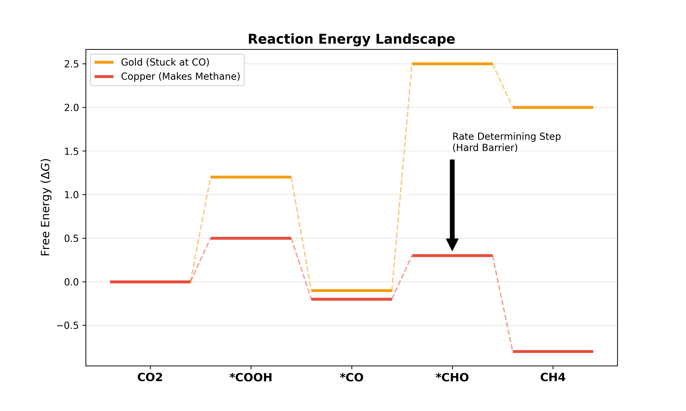
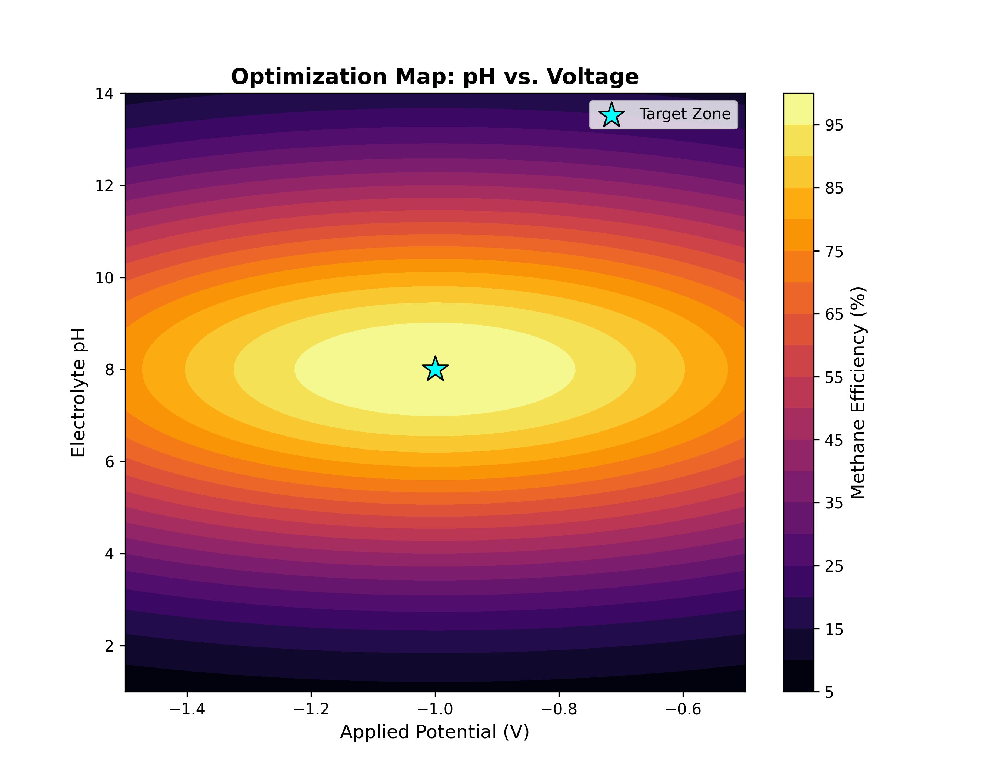

# Foundations & Theory
*Part 1: The Electrochemical Basics*

---

## 1. The Big Picture
To understand this project, we must first know what electrochemical reduction is. In chemistry, "reduction" simply means gaining electrons.

Most people are familiar with combustion, where we burn a fuel with oxygen to release energy. This process produces carbon dioxide ($$CO_2$$) and water.

$$ Fuel + Oxygen \rightarrow CO_2 + H_2O + Energy $$

We can actually reverse that process and that is essentially what "$$CO_2$$ Reduction ($$CO_2$$R)" is. We use energy from different sources (like heat or light) to complete this process, but electrical energy is what we will be focusing on as it is the most efficient yet. Using energy to force electrons back into carbon dioxide, we can convert it from a waste product back into a useful fuel or chemical feedstock, naming it the process of "electrochemical CO2 reduction".

$$ CO_2 + H_2O + Energy (Electricity) \rightarrow Fuel + Oxygen $$

Because $$CO_2$$ is an extremely stable molecule, it does not want to react. It requires a significant amount of energy and a specific environment to break its bonds and form new ones. This is why we need an electrochemical cell.

*Figure : The "Family Tree" of CO2 reduction products.*

---

## 2. Basic Electrochemistry
Experiments in this field take place inside an "electrolytic cell". An electrolytic cell uses an external power source to force non-spontaneous chemical reactions to happen. Think of it as charging a battery, but instead of storing the energy inside the battery itself, we are storing the energy in the liquid fuel we create. The 'Cathode' is where we shove electrons in to build these fuel molecules.

There are two sides of the reaction which can happen in electrochemstry:

### The Cathode (The Reduction Site)
The cathode is the "electrode" connected to the negative terminal of the power supply. This is where electrons enter the solution.
*   **What happens here:** Positive ions or neutral molecules (like $$CO_2$$) are attracted to the surface. They accept electrons and undergo reduction.
*   **Function:** This is the most important part of the setup. The material of the cathode determines what product you make. Researchers are working together to create better cathode which makes better product.
*   **Key Equation:** $$ CO_2 + 2H^+ + 2e^- \rightarrow CO + H_2O $$

### The Anode (The Oxidation Site)
The anode is the "electrode" connected to the positive terminal. This is where electrons leave the solution to return to the power supply.
*   **What happens here:** To balance the electrons used at the cathode, something must lose electrons (oxidize) at the anode. In most experiments, water is oxidized into oxygen gas.
*   **Function:** While we focus on what is happening on the cathode, the anode is necessary to complete the circuit.
*   **Key Equation:** $$ 2H_2O \rightarrow O_2 + 4H^+ + 4e^- $$

---

## 3. The Core Idea
If we are applying electricity, why doesn't the CO2 just break apart on its own?

### The Stability Problem
Carbon Dioxide is an incredibly stable molecule: it has a linear shape ($$O=C=O$$) with strong double bonds. It is already happy as is and resist changes coming in its way. So if you just stick a wire in water and apply voltage, don't expect long chain carbon compound to form; the electricity will ignore $$CO_2$$ and just split water, which is easy to break apart, instead.

### What the Catalyst Does
This is where the metal electrode comes into play. The reaction does not happen in the liquid; it happens on the surface of the metal.
1.  **Adsorption:** The $$CO_2$$ molecule lands on the metal surface.
2.  **Activation:** The metal atoms grab the Carbon and Oxygen, physically bending the molecule. This bending weakens the bonds, making it easier for electrons to attack.
3.  **Formation:** The electron attack the reactants, breaking them apart. The atoms then combine with each other, forming new molecules which is our product.
4.  **Desorption:** Once the fuel is made, the metal must let go so the product can float away and make room for more $$CO_2$$.

### The "Goldilocks" Zone
The metal must bind to the $$CO$$ (the intermediate) with just the right amount of force for it to create products efficeintly. Scientists are trying to find or design a material that is just right.

*Figure : The Volcano Plot. Copper sits near the peak, making it the most versatile catalyst for hydrocarbons.*

*   **Too Weak:** If the metal doesn't hold onto the $$CO$$ strongly enough, they will just fly away and the main product will be $$CO$$.
*   **Too Strong:** If the metal grabs too tight, the $$CO$$ gets stuck. The surface gets clogged by all the $$CO$$, preventing new $$CO_2$$ from entering. The reaction stops. This is the term define as "surface poisoning".
*   **Just Right:** The metal holds onto $$CO$$ long enough to transform it into hydrocarbon, but lets go of after the product form.

**Analogical Compairsion**
Imagine the CO as a ball that you are trying to catch and throw and the catalyst as your hand
*   **Too Weak:** Slippery hand. You catch the ball but it immediately falls out of your hand. Unsuccessful.
*   **Too Strong:** You put superglue on your hand. You catch the ball perfectly, but can't throw it. The ball is stuck, and your hand is useless for catching the next one. Unsuccessful.
*   **Just Right:** You catch the ball successfully and hold it tight just enough to throw it out. Successful

The goal of the research is to find a catalyst surface that has this perfect balance.

---

## 4. Understanding Measurements and Variables
In an electrochemical experiment, there are two main parameters we can alter or measure: Potential and Current. It is vital to understand the difference between the driving force and the reaction rate.

### Potential (Voltage)
Potential is the energy or basically, the push applied to the system. Every chemical reaction has its own minimum energy requirement to proceed.
*   **Thermodynamic Potential:** This is the theoretical minimum voltage needed to start the reaction. For converting $$CO_2$$ to Carbon Monoxide, this is approximately -0.11 Volts.
*   **Applied Potential:** This is the real potential applied in the real experiment, which is significantly more than the theoretical value. This is because real-world electrochemical reactions are hardly perfectly efficient and requires additional energy to overcome the theroretical minimum.

### Current (Amperage)
While voltage is the push, the current is the flow. Current measures the rate at which electrons are moving across the interface. Since the chemical reaction consumes electrons, the current tells you directly how fast the reaction is happening.
*   **High Current:** A fast reaction rate.
*   **Low Current:** A slow reaction rate.

### Surface Area and Normalization
A large piece of copper will naturally allow more current to pass than a thin copper wire, just because there is more space for the reaction to occur. This makes comparision unfair. So, to make fair comparisons between different experiments, we wil look at "Current Density" instead. This is the ratio of current by surface area of the electrode, telling us how active the material is regardless of its size.

## 4. Thermodynamics and Kinetics
Why does the reaction does not start exactly at the theoretical voltage?

### The Energy Barrier
Even if you apply enough energy to make the reaction possible, the reaction might still be too slow to measure. This is because molecules need to rearrange themselves, bonds need to break, and intermediates need to form.

### Overpotential
To overcome this slowness, we apply extra voltage. This extra voltage is the "Overpotential".
*   If a catalyst is "good," it requires very little overpotential to reach a high current.
*   If a catalyst is "bad," you must apply a massive voltage to get even a small current.

In research, the goal is often to find a setup that produces the most product with the least amount of overpotential.

*Figure : The Energy Landscape. The catalyst must help the molecule climb these energy "hills" to form new bonds.*

---

## 5. Selectivity and the Competing Reaction
The most difficult part of $$CO_2$$ reduction is not breaking the $$CO_2$$; it is avoiding the water.

### The Hydrogen Problem
Since our electrolyte is mostly water, there are billions of water molecules surrounding the electrode for every one CO2 molecule. Water can also accept electrons to form Hydrogen gas ($$H_2$$).
$$ 2H^+ + 2e^- \rightarrow H_2 $$

This is called the "Hydrogen Evolution Reaction (HER)". It is an annoying competing reaction that wastes electricity and hinders reactions that we actually want.

### Selectivity (Faradaic Efficiency)
We measure the efficiency using "Faradaic Efficiency (FE)". It represents the percentage of electrons that went into making the product you want against all the products produced (including Hydrogen).
**Example:**
*   **100% FE:** Every electron resulted in $$CO_2$$ reduction.
*   **50% FE:** Half of the electron resulted in $$CO_2$$ reduction.
*   **0% FE:** All electrons were wasted making Hydrogen gas.

---

## 6. Catalyst materials
Not all metals act the same and they can often be categorized into three groups based on what they produce:

### Group 1: Hydrogen Producers
**Metals:** Platinum (Pt), Nickel (Ni), Iron (Fe), Titanium (Ti) and more.
Do not use these metals if you are aiming for $$CO_2$$ reduction.
*   **Behavior:** These metals bind to Hydrogen atoms very strongly.
*   **Typical Products:** Mostly Hydrogen gas. The CO2 will barely touch the surface.

### Group 2: Two-Electron Pathway (CO / Formate)
**Metals:** Silver ($$Ag$$), Gold ($$Au$$), Zinc ($$Zn$$), Tin ($$Sn$$) and more.
They are great for beginners; however, different metals are specialized in making different product, so research first on what products you are looking for. For example, Zinc makes Formate and Silver makes $$CO$$ efficiently.
*   **Behavior:** These metals are poor at making hydrogen, allowing CO2 to react. However, they stop the reaction early and separate from the reaction site.
*   **Typical Products:** Carbon Monoxide ($$CO$$) or Formate ($$HCOO-$$).

### Group 3: Hydrocarbon Pathway
**Metal:** Copper ($$Cu$$)
It is unique in the periodic table and the only metal known to make multi-carbon products (very valuable). However, it is complex as it produces a mix of different products' state at once and can be somewhat unpredictable. Scientist are trying to tune the metal and understand mechanism of how each product forms in different environment.
*   **Behavior:** Copper has just the right binding energy with the Carbon atom. This allows the carbon atoms to bond with other Carbon atoms without dettaching from the surface of the metal first.
*   **Typical Products:** Methane ($$CH_4$$), Ethylene ($$C_2H_4$$), and Ethanol ($$C_2H_5OH$$).

*Figure : Metals color-coded by their primary product.*

---

## 7. The Physical Limit
We must understand the environment and its limit in real-world. $$CO_2$$ is a gas, but the reaction happens on the solid metal surface inside a liquid. For the reaction to work, $$CO_2$$ gas must dissolve into the water to reach the electrode.
Some of the limits are:
1.  **Solubility:** CO2 does not dissolve well in water: just around 33mM concentration at room temperature.
2.  **Mass Transport:** As you run the reaction, you use up the CO2 near the metal surface. If new CO2 cannot diffuse in fast enough, the reaction stops and Hydrogen evolution takes over instead.

This is why you will see instructions to bubble CO2 gas continuously into the solution. It keeps the water saturated with CO2, giving enough room for valuable reactions to happen. 

---

## Extra: Common Misconception (Under Reconstruction)
These are the common misconception you may have along exploring this new topic.

**1. Where does the Hydrogen come from?**
You will notice the equations have $$H^+$$ in them.
($$ CO_2 + 2H^+ + 2e^- \rightarrow CO + H_2O $$)
But if we are only pumping in $$CO_2$$ gas, where is the $$H^+$$ even coming from?
*   **The Answer:** It comes from the water ($$H_2O$$) or the Bicarbonate ($$HCO_3^-$$) in the electrolyte. This is why the reaction must happen in a water-based solution. The electricity splits the water and provide the protons needed to form the coumpounds.

**2. What does the product look like?**
When we say "Fuel," don't expect liquid gasoline or diesel to drip right off the electrode.
*   **Gas Products:** Carbon Monoxide ($$CO$$), Methane ($$CH_4$$), and Ethylene ($$C_2H_4$$) will appear as bubbles mixing with the unreacted $$CO_2$$ bubbles.
*   **Liquid Products:** Formate ($$HCOO^-$$) and Ethanol ($$C_2H_5OH$$) will dissolve into the water. You won't be able to distinguishes them from water. You will have to test the liquid later to find out the what actually comes out.

---

## Extra: The Reaction Environment (Under Reconstruction)
To truly control the reaction, you must look beyond the metal and look at the liquid environment.

### The "Local pH" Effect
One of the most critical concepts in modern CO2 research is the difference between the Bulk pH (the liquid in the middle of the beaker) and the Local pH (the liquid touching the catalyst surface).

**The Chemistry:**
When CO2 is reduced, the reaction consumes protons ($H^+$) or generates hydroxide ($OH^-$):
$$ CO_2 + H_2O + 2e^- \rightarrow CO + 2OH^- $$

This rapid production of $OH^-$ causes the pH near to the electrode to spike drastically (often rising to pH 10 or 11), even if the bulk solution remains neutral.

### Why High pH is Good
A high local pH is actually beneficial for two reasons:
1.  **Suppresses Hydrogen:** The Hydrogen Evolution Reaction (HER) requires protons ($H^+$). By depleting protons near the surface, we starve the HER side-reaction.
2.  **Favors C-C Coupling:** Advanced research suggests that a high local pH helps Carbon atoms stick together, promoting the formation of Ethylene and Ethanol over simple Methane.

This is why we use buffers like Potassium Bicarbonate ($KHCO_3$). They are good at maintaining a neutral bulk pH while allowing the necessary local pH gradients to establish on the surface.

*Figure : Visualizing the complex relationship between Voltage, pH, and Efficiency.*

