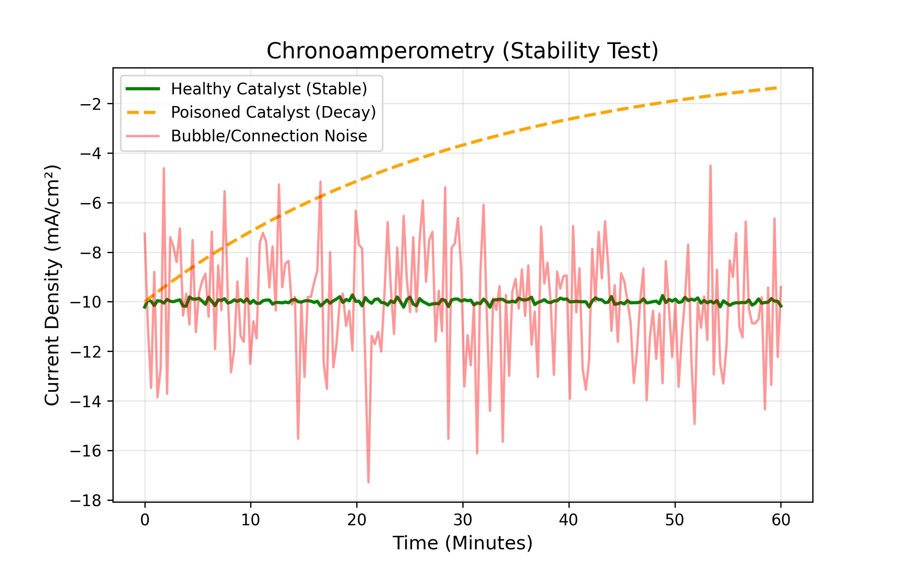

# Common Problems & Troubleshooting
*Part 4: A Diagnostic Approach to Unexpected Experimental Outcomes*

---

## Quick Check

| Symptom | Possible Cause | Go To Section |
| :--- | :--- | :--- |
| Current is 0.00 A | Broken circuit or loose cable | Section 2 |
| Current is fluctuating wildly | Trapped bubbles or loose connection | Section 3 |
| Liquid level is changing | Membrane leak | Section 4 |
| Data looks weird or drifted | Reference electrode issue | Section 3 |

  

    
What is the main issue you are experiencing?

    

      <!-- Options injected by JS -->
    

  

  
  

    <h3 style="margin-top:0; color: #2e7d32;" id="res-title">Diagnosis</h3>
    

    <button class="restart-btn" onclick="startWizard()">🔄 Start Over</button>
  

  

    
📈 The "Jagged" Line

    
📉 The Decaying Curve

    
➖ The Flat Line

  

  <!-- Tab 1: Jagged -->
  

    <svg class="noise-svg" viewBox="0 0 400 120">
      <polyline points="0,60 20,40 40,80 60,30 80,90 100,20 120,70 140,50 160,80 180,40 200,90 220,30 240,80 260,50 280,70 300,40 320,90 340,30 360,80 380,40 400,60" fill="none" stroke="#d32f2f" stroke-width="2"/>
    </svg>
    <h3 style="margin-top:0; color: #d32f2f;">Wild Fluctuations</h3>
    
<strong>Diagnosis:</strong> Physical disruption in the circuit.

    
<strong>Physical Cause:</strong> Large CO₂ bubbles are forming and getting trapped on your Working Electrode, temporarily blocking the surface area before popping off. Alternatively, you have a loose alligator clip vibrating on the desk.

    
<strong>Fix:</strong> Increase the stirring speed, adjust electrode placement, or secure your cables with tape.

  

  <!-- Tab 2: Decaying -->
  

    <svg class="noise-svg" viewBox="0 0 400 120">
      <path d="M 0,20 Q 100,20 200,80 T 400,100" fill="none" stroke="#f57c00" stroke-width="3"/>
    </svg>
    <h3 style="margin-top:0; color: #f57c00;">Continuous Current Drop</h3>
    
<strong>Diagnosis:</strong> Catalyst Deactivation.

    
<strong>Physical Cause:</strong> Your catalyst is dying. It might be getting poisoned by metal impurities in your electrolyte (like Iron or Zinc depositing on your Copper), or the surface is being covered by carbonaceous species.

    
<strong>Fix:</strong> Clean your electrolyte (use pre-electrolysis), use higher purity salts, or check if your catalyst is physically peeling off the substrate.

  

  <!-- Tab 3: Flat -->
  

    <svg class="noise-svg" viewBox="0 0 400 120">
      <line x1="0" y1="100" x2="400" y2="100" stroke="#1976d2" stroke-width="3"/>
    </svg>
    <h3 style="margin-top:0; color: #1976d2;">Absolutely Zero Current</h3>
    
<strong>Diagnosis:</strong> Open Circuit.

    
<strong>Physical Cause:</strong> Electricity cannot flow. A cable is unplugged, the potentiostat output is turned off, or an electrode broke in half under the liquid.

    
<strong>Fix:</strong> Check all physical connections. Ensure the Potentiostat software actually says "Cell On".

  

---

## 1. The Diagnostic Philosophy
When an electrochemical experiment runs wild, it is rarely random: commonly associated with one or more uncontrolled factors. Successful troubleshooting depends on isolation and inspection of these variables.

The root of the problems often stems from these:
1.  **The Physics:** Is the electrical path complete?
2.  **The Chemistry:** Is the reaction environment proper?
3.  **The Analysis:** Is the math or calibration correct?

---

## 2. Category A: Electrical Anomalies
These issues pop up immediately upon starting the experiment and are generally related to charge movement.
### Issue: Incomplete Circuit
*   **Symptom:**
    The current remains only at 0.00 A or flucuate at noise level ($<1 \mu A$).
*   **Example of Potential Causes:**
    1.  Break or discontinuity in the wire path.
    2.  Connection of alligator clips to plastic insulation rather than metal.
    3.  Air bubble blocking the slat bridge or glass frit.
*   **Common Diagnosis:**
    Confirm the contunitity of the wire using device like ammeter or multimeter. If the wires are confirmed to connected, the issue may lie with an air bubble trapped inside a glass frit or a salt bridge acts. This bubble act as an electrical insulator, cutting of anode and cathode and rendering the circuit incomplete.
    
### Issue: High Impedance / Compliance Error
*   **Symptom:**
    The power supply or potentiostat hits its maximum voltage limit while not delivering the expected current.
*   **Potential Causes:**
    1.  Electrolyte concentration not appropriate, resulting in low conductivity.
    2.  Excessive distance between Working and Counter electrodes.
    3.  Membrane dehydration.
*   **Suggestion/Diagnosis:**
    This indicates High Cell Resistance (IR Drop). The electricity is struggling to push through the liquid. It is frequently observed when using ion-exchange membranes that were not properly soaked in water or activated before usage, as dry membranes are highly resistive.

---

## 3. Category B: Electrochemical Performance
The chemical reaction is not behaving as predicted.

*Figure : Diagnostic Stability Plots. Green = Healthy. Orange = Poisoned (decaying). Red = Noise (bubbles/loose wire).*

### Issue: Catalyst Deactivation
*   **Symptom:**
    The current starts high and promising, but then decays rapidly (e.g. dropping by 50% within the first 20 minutes) without stabilizing.
*   **Potential Causes:**
    1.  Adsorption of impurities (Poisoning).
    2.  Surface oxidation.
    3.  Bubble accumulation masking the surface.
*   **Suggestion/Diagnosis:**
    Most often, this indicates electrolyte contamination. Trace organic compounds from plastic tubing or unwashed glassware may clog the active sites of the catalyst. If the decay is erratic, gas bubbles may be sticking to the electrode surface, thereby, blocking the liquid from touching the metal.

*Figure : Simplified Pourbaix Diagram for Copper. To prevent your electrode from dissolving (Corrosion), you must keep your voltage and pH in the yellow "Immunity" region.*

### Issue: Selectivity Loss
*   **Symptom:**
    The current is stable and high, but the Faradaic Efficiency shows low carbon-based fuels and high Hydrogen.
*   **Potential Causes:**
    1.  Trace metal contamination (Iron/Zinc/Nickel).
    2.  Depletion of local $CO_2$.
*   **Suggestion/Diagnosis:**
    This is frequently caused by Underpotential Deposition. If low-purity salts are used, trace amounts of Iron ($Fe$) can dissolve into the liquid and plate onto the Copper cathode. Since Iron is an excellent catalyst for Hydrogen evolution, the reaction could shifts to making Hydrogen, ignoring the $CO_2$.

### Issue: Signal Instability (Noise)
*   **Symptom:**
    The Current vs. Time plot appears jagged or oscillates rather than forming a smooth line.
*   **Potential Causes:**
    1.  Reference Electrode instability.
    2.  Hydrodynamic turbulence.
    3.  Loose connections.
*   **Suggestion/Diagnosis:**
    If the oscillation is rhythmic, it often suggests bubble dynamics: bubbles growing and detaching from the electrode surface, changing the effective surface area; this is actually normal and okay to continue. But, if the noise is random and sharp, it typically points to an air bubble trapped in the tip of the Reference Electrode, causing the potentiostat to lose its suppposedly constant reference voltage.

---

## 4. Category C: Physical & Mechanical Failures
Invalidation cause by failure in the H-Cell setup that alters the chemical environment.

### Issue: Electrolyte Crossover
*   **Symptom:**
    The liquid level in one chamber rises while the other drops over the course of experiment.
*   **Potential Causes:**
    1.  Tear in the membrane.
    2.  Osmotic pressure imbalance.
*   **Common Diagnosis:**
    If the membrane is intact, this is often a result of Osmotic Drag. If the concentration of ions is significantly different between the anode and cathode chambers, water might migrate through the membrane to balance the concentration, diluting the electrolyte and altering the pH.

### Issue: Gas Leak
*   **Symptom:**
    The Current is stable, but the Calculated Efficiency is anomally low (e.g. the sum of all products is only 30% instead of near 100%).
*   **Potential Causes:**
    1.  Worn-out rubber septa.
    2.  Loose fittings on the gas exhaust line.
    3.  Poor seal between the glass chambers and the clamp.
*   **Common Diagnosis:**
    If the electricity passed suggests you made 10 moles of gas, but you only collected 3 moles, the gas didn't disappearit, it leaked. A simple Soap Bubble Test often reveals leaks in the headspace.
